# User Manual — Teaching Assistant Recruitment System

## Introduction

The Teaching Assistant (TA) Recruitment System is a lightweight web application for the
BUPT International School. It replaces spreadsheet-based TA recruitment with a simple
workflow shared by three roles: TA Applicants apply for jobs and track their status,
Module Organisers (MOs) post jobs and review applicants, and Admins monitor TA workload.
The system also provides explainable, advisory AI-assisted features — skill matching and
workload-balancing recommendations — that support human decisions without replacing them.

## Setup and Run

1. Install JDK 17, Maven 3.9+, and a Servlet 6 container such as Tomcat 10.1.
2. From the project root, build the application:

   ```bash
   mvn clean package
   ```

3. Deploy the generated WAR (`target/ta-recruitment-system-1.0.0-SNAPSHOT.war`) to
   Tomcat's `webapps/` folder and start Tomcat.
4. Open `http://localhost:8080/ta-recruitment-system-1.0.0-SNAPSHOT/` in a browser.
   The entry page redirects to the login screen.

Runtime data is stored as JSON files under a `data/` directory resolved from the server's
working directory. If the seed accounts do not work after deployment, copy the project's
`data/` folder to the server working directory. To run the test suite, use `mvn test`.

## Seed Accounts

| Username | Password | Role |
| --- | --- | --- |
| `ta01` | `ta01` | TA Applicant |
| `ta02` | `ta02` | TA Applicant |
| `ta03` | `ta03` | TA Applicant |
| `mo01` | `mo01` | Module Organiser |
| `admin01` | `admin01` | Admin |

## Screens

### Login

The login screen is the entry point for all users. Enter a username and password and
submit to sign in; the system routes you to the home page for your role. A link to the
registration page is provided for new applicants.

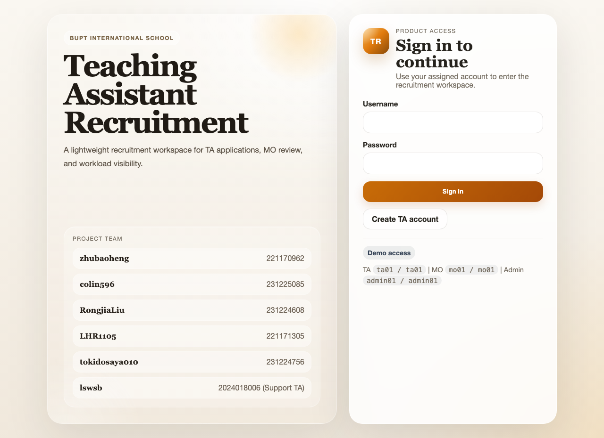

### Register

The registration screen lets a new user create a TA Applicant account. Choose a username,
enter a password, and confirm it; the form rejects blank fields, mismatched passwords, and
duplicate usernames. On success you are returned to the login screen to sign in.

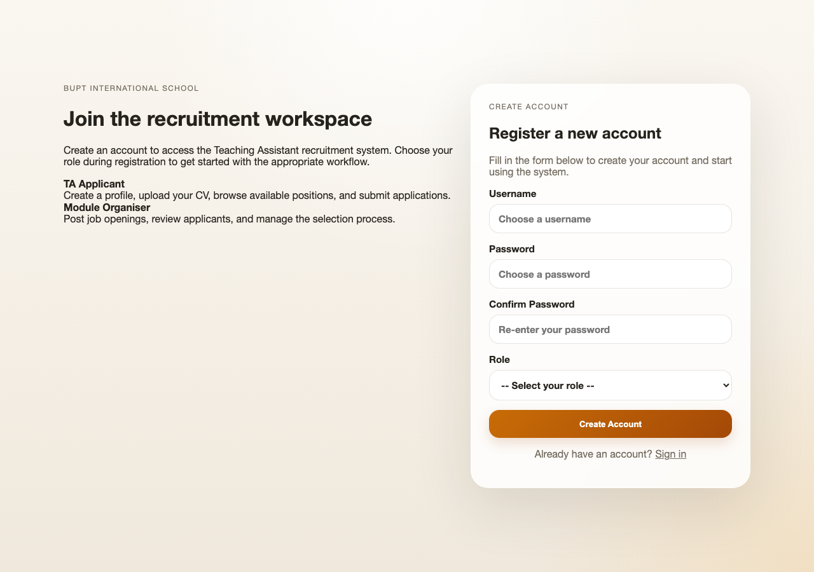

### Role Home

After signing in, the role home page is your landing screen. It greets you by name and
provides navigation links to the screens available for your role. Use it as the starting
point for every task.

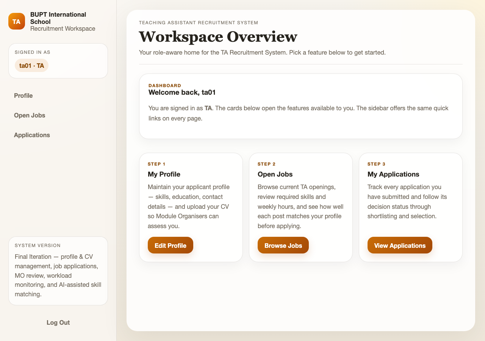

### TA Profile

The profile screen is where a TA Applicant maintains their personal details, major, grade,
availability, skills, project experience, and self-introduction. Keeping the skills list
accurate is important because it drives the skill-match scores shown on job pages. You can
also upload a CV file here and preview it in the browser.

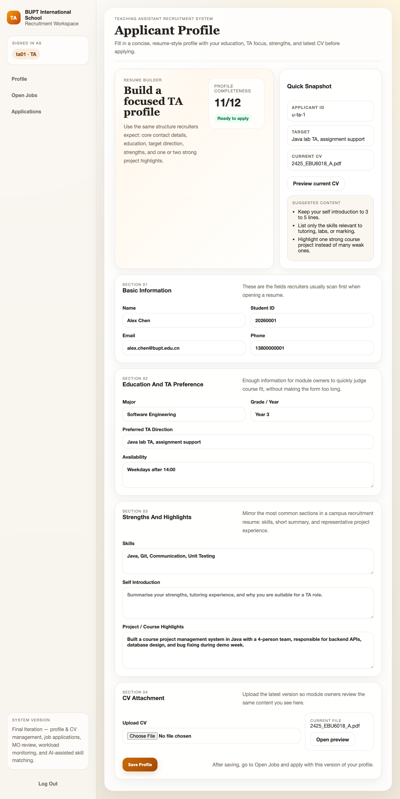

### TA Jobs

The jobs screen lists all currently open TA positions. Each entry shows the module and a
match indicator — a score plus matched and missing skills — calculated from your profile.
Use the match information to judge fit, then open a job for full details.

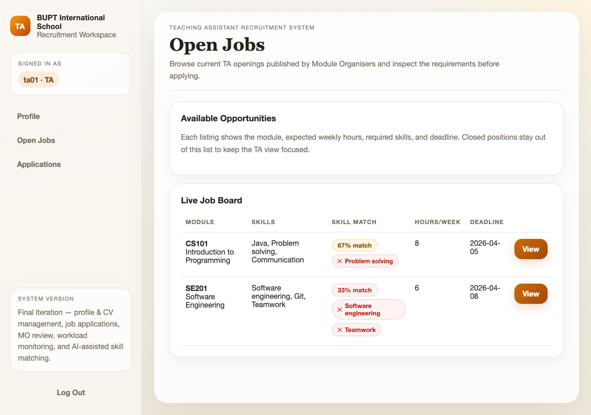

### TA Job Detail

The job detail screen shows the full description of one job: module, required skills,
hours, and other information. It repeats the explainable match summary so you can see which
required skills you already cover and which to strengthen. Use the apply button to submit
an application for this job.

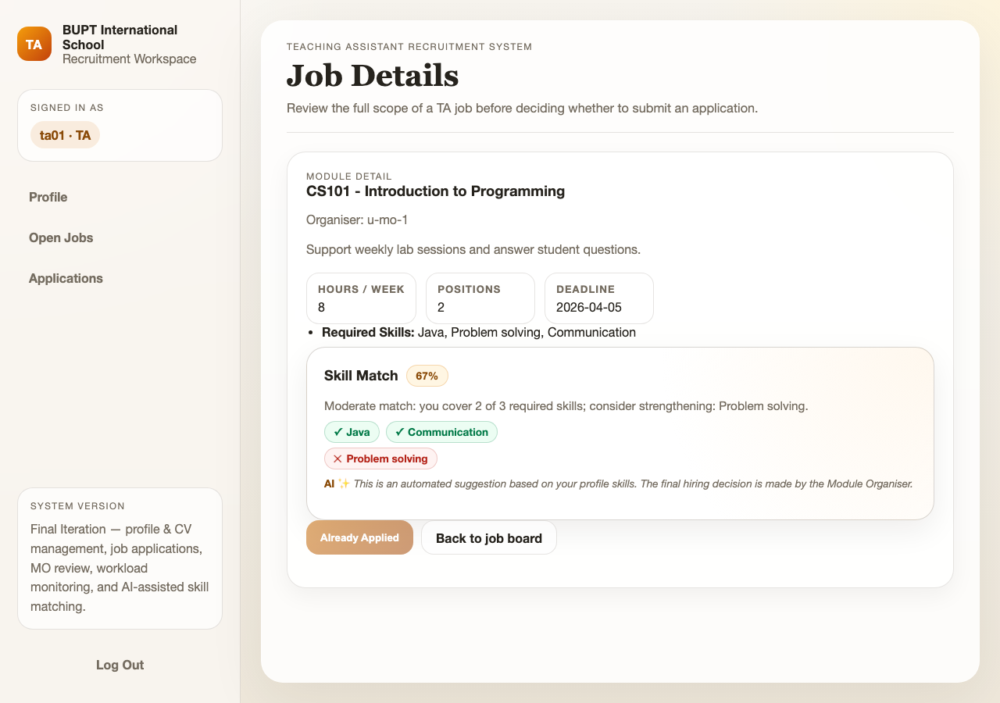

### TA Applications

The applications screen lists every job you have applied for and the current decision
status of each (for example Submitted, Shortlisted, Selected, or Rejected). Use it to track
progress without contacting the MO directly. The list updates as MOs review your
applications.

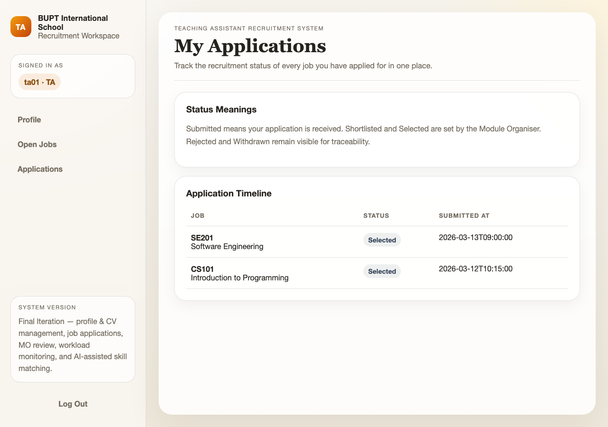

### MO Jobs

The MO jobs screen lists the job posts and is the starting point for managing them. From
here a Module Organiser can open the form to create a new post, edit an existing one, or
close a post so it stops accepting applications. Each row links through to its applicants.

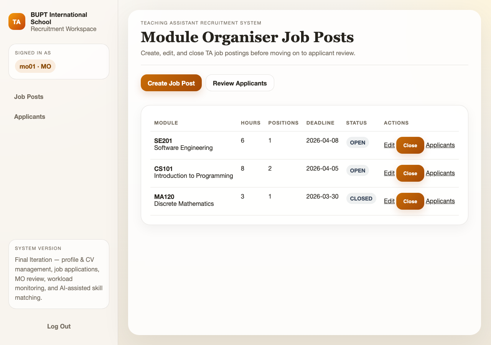

### MO Job Form

The job form is used to create a new job post or edit an existing one. Fill in the module
code and name, description, required skills, and hours, then save. The required-skills
field feeds the skill-matching feature, so list the skills the role genuinely needs.

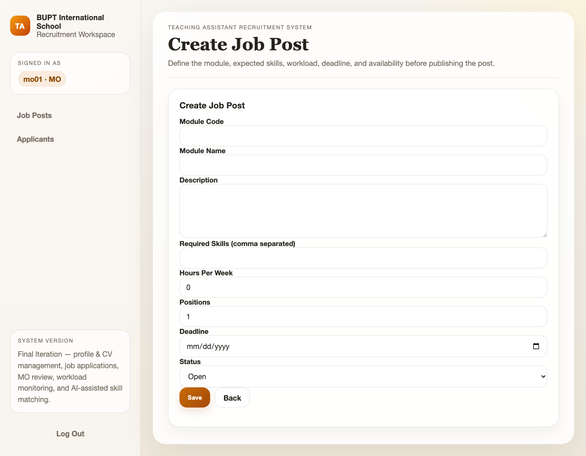

### MO Applicants

The applicants screen lists everyone who has applied to a selected job, ranked by skill
match score so the strongest candidates appear first. The ranking is advisory only — the
full profile is shown alongside each score so you can apply your own judgement. Open an
applicant to review them in detail.

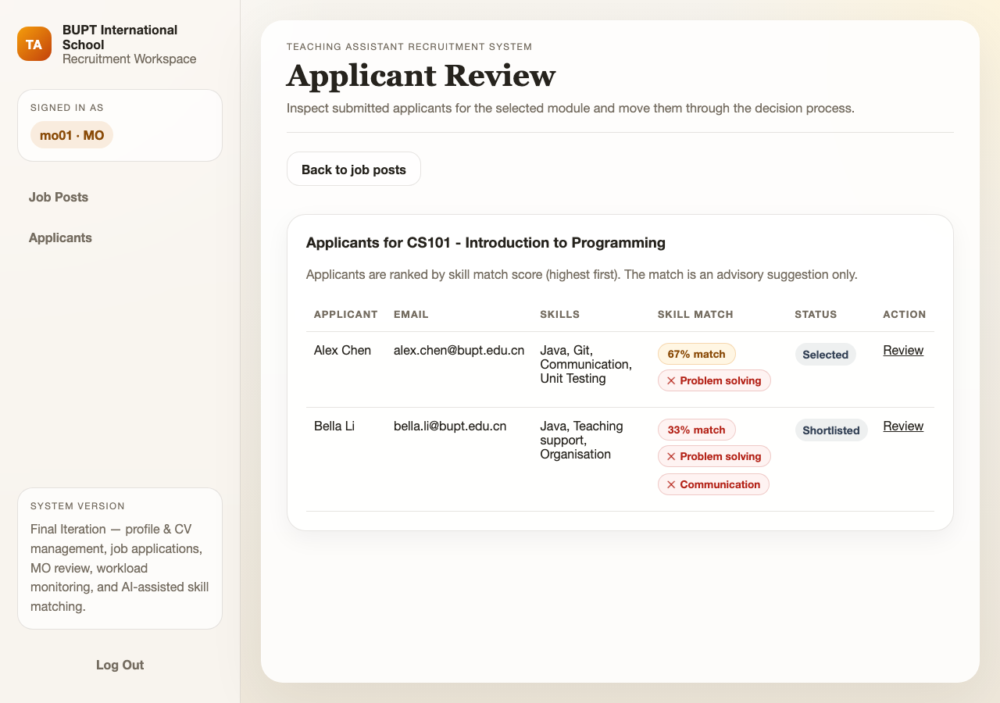

### MO Applicant Detail

The applicant detail screen shows one applicant's full profile, CV, and explainable match
breakdown (matched and missing skills with a plain-English explanation). After reviewing,
set the decision to Shortlisted, Selected, or Rejected. The decision rests with the MO; the
match score only informs it.

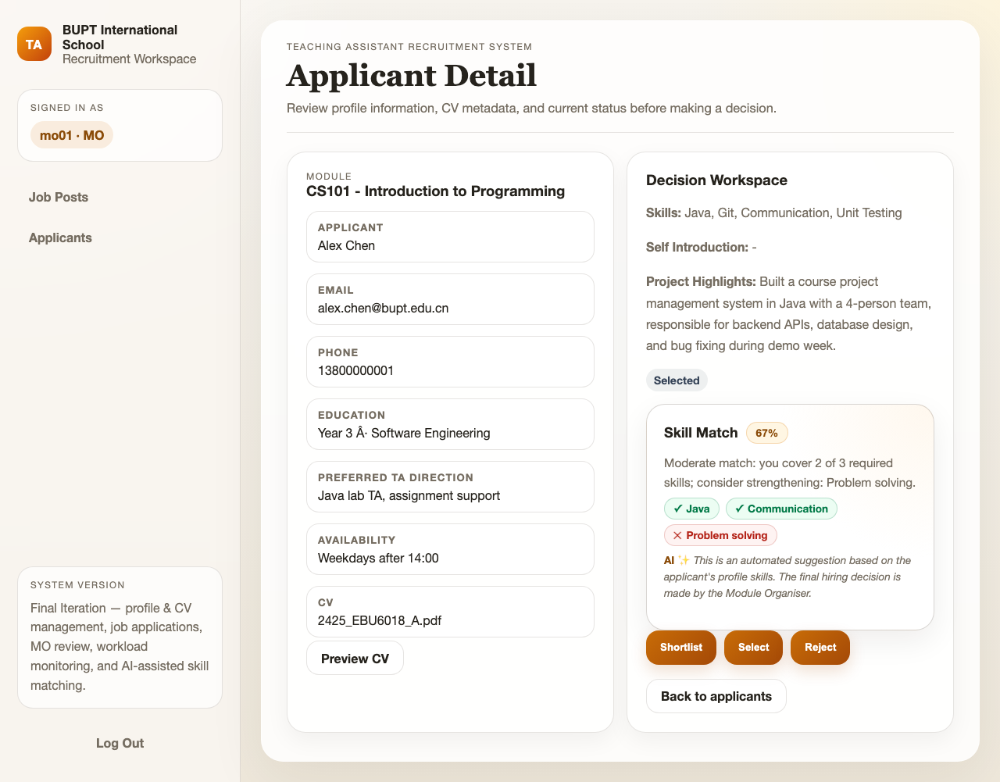

### Admin Workload

The workload screen gives the Admin an overview of every TA's assigned hours and flags
anyone above the overload threshold. It also lists rule-based workload-balancing
recommendations, each suggesting a specific reassignment with a human-readable reason. The
recommendations are advisory — the Admin decides whether to act on them.

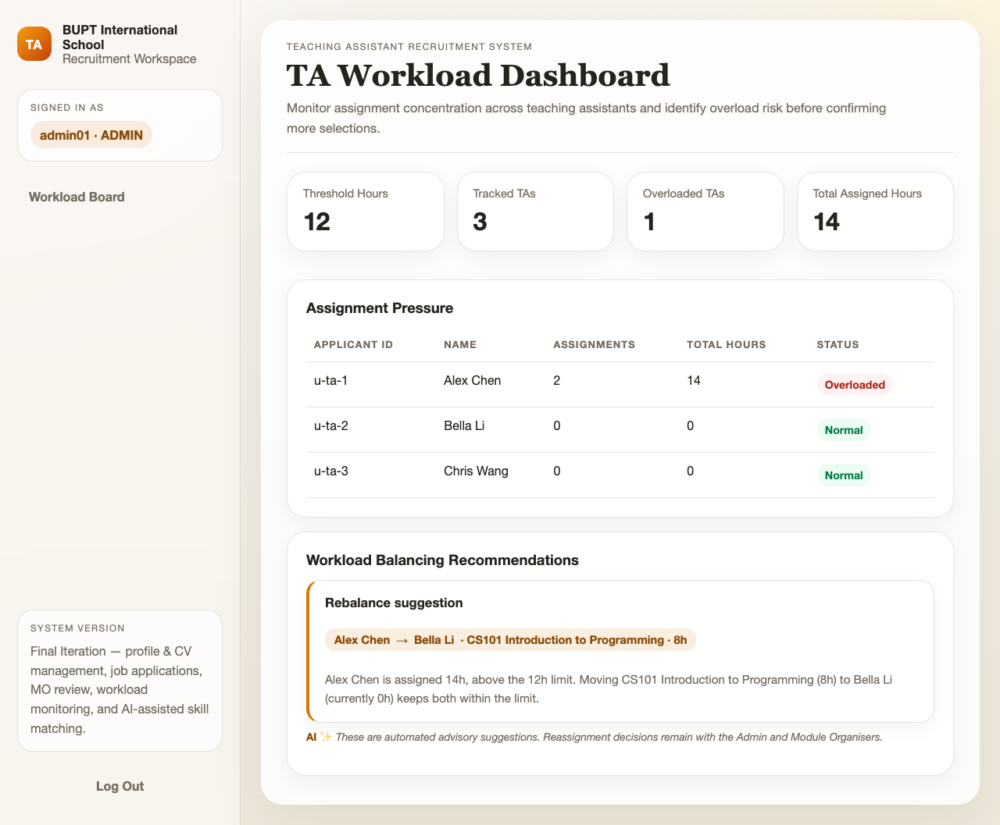
